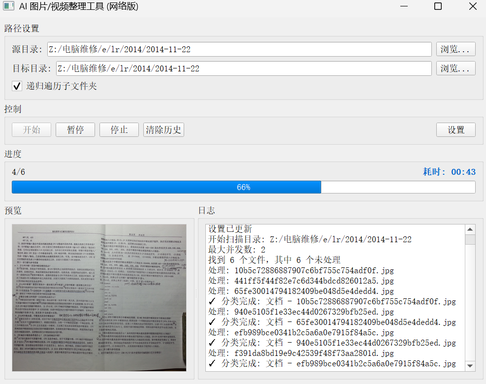
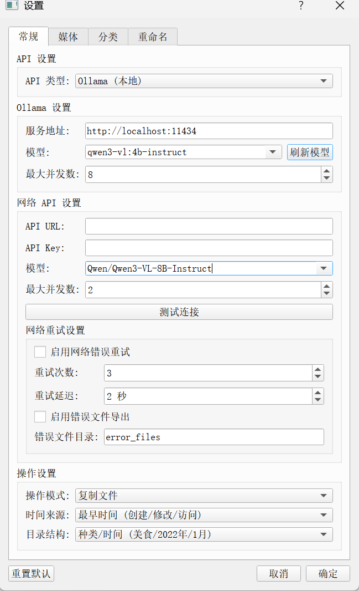
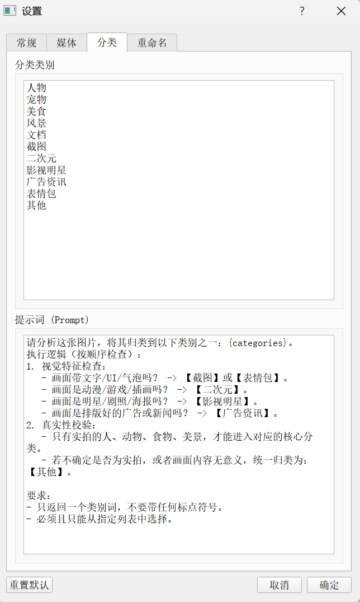
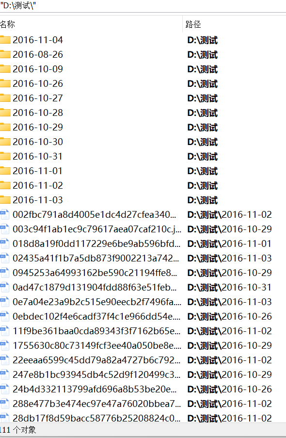
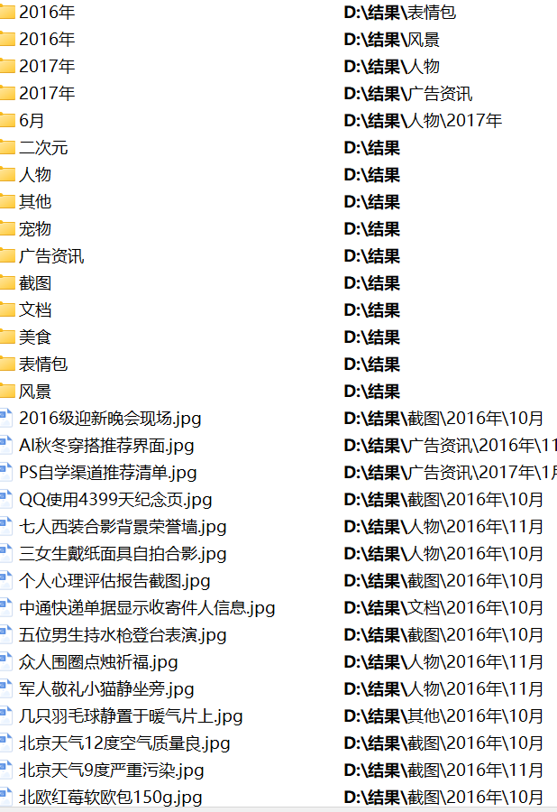

# 大模型媒体整理大师

基于大模型的智能图片/视频分类整理工具，支持本地 Ollama 和网络 API（如硅基流动）。

## 功能特点

- 🔍 **智能分类** - 使用 AI 自动识别图片/视频内容并分类
- 📁 **自动整理** - 按类别和时间自动整理文件
- 🎬 **视频支持** - 支持视频文件的多帧提取和分类
- 🔄 **多线程处理** - UI 不卡顿，流畅体验
- ⏯️ **暂停/继续** - 支持任务暂停和继续
- 📊 **进度显示** - 实时显示处理进度和耗时
- 🌐 **网络 API 支持** - 支持使用硅基流动等网络 API 进行分类
- 📝 **智能重命名** - 使用 AI 为文件生成简短的自然语言描述
- 🔄 **网络错误重试** - 自动重试网络错误，提高成功率
- ❌ **错误文件导出** - 自动将处理失败的文件导出到指定目录

## 效果展示

### 运行界面



### 设置页面





### 整理效果

#### 整理前



#### 整理后



## 安装

> ⚠️ **注意事项**
> - 安装目录路径**禁止包含中文字符**，否则可能导致程序无法正常运行
> - 建议安装在纯英文路径下，如 `D:\Tools\Ai_pick`

1. 安装 Python 3.8+
2. 安装 Ollama 并下载视觉模型（如 llava:7b）
3. 创建虚拟环境：

```bash
python -m venv venv
```

4. 激活虚拟环境：

Windows:
```bash
venv\Scripts\activate
```

Linux/Mac:
```bash
source venv/bin/activate
```

5. 安装依赖：

```bash
pip install -r requirements.txt
```

## 使用方法

1. 启动 Ollama 服务
2. 激活虚拟环境（如已激活可跳过）
3. 运行程序：

Windows:
```bash
venv\Scripts\python main.py
```

Linux/Mac:
```bash
venv/bin/python main.py
```

3. 选择源目录和目标目录
4. 点击"开始处理"

## 设置说明

### Ollama 设置
- **Ollama URL**: Ollama 服务地址，默认 `http://localhost:11434`
- **模型**: 选择使用的视觉模型
- **并发数**: 同时处理的文件数量

### 网络 API 设置
- **API 类型**: 选择使用 Ollama (本地) 或网络 API
- **网络 API URL**: 第三方 API 服务地址，默认 `https://api.siliconflow.cn/v1/chat/completions`
- **API Key**: 第三方 API 服务的访问密钥
- **网络 API 模型**: 选择使用的网络视觉模型，默认 `Qwen/Qwen3-VL-8B-Instruct`
- **网络 API 并发数**: 同时处理的文件数量，默认 2

### 其他设置
- **抽帧数量**: 视频分类时提取的帧数
- **抽帧模式**: 
  - 中间帧：视频中间位置
  - 随机帧：随机选择帧
  - 开头附近：视频开头位置
  - 结尾附近：视频结尾位置
  - 首帧/尾帧：第一帧或最后一帧
- **操作模式**: 移动或复制文件
- **分类类别**: 自定义分类类别

### 重命名设置
- **启用文件重命名功能**: 开启/关闭文件重命名
- **重命名提示词**: AI 生成文件描述的提示词
- **包含原始文件名**: 是否在新文件名中包含原始文件名
- **日期类型**: 选择是否在文件名中包含日期，以及日期类型
- **日期格式**: 日期的显示格式

### 网络重试设置
- **启用网络错误重试**: 开启/关闭网络错误自动重试
- **重试次数**: 网络错误时的重试次数
- **重试延迟**: 每次重试前的等待时间
- **启用错误文件导出**: 开启/关闭错误文件导出
- **错误文件目录**: 存储错误文件的目录

## 目录结构

```
├── main.py              # 程序入口
├── config.py            # 配置管理
├── requirements.txt     # 依赖列表
├── core/                # 核心模块
│   ├── classifier.py    # 分类器
│   ├── database.py      # 数据库
│   ├── file_mover.py    # 文件移动
│   ├── file_scanner.py  # 文件扫描
│   ├── image_processor.py # 图像处理
│   ├── network_client.py # 网络 API 客户端
│   ├── siliconflow_client.py # 硅基流动客户端
│   └── ollama_client.py # Ollama 客户端
├── ui/                  # 界面模块
│   ├── main_window.py   # 主窗口
│   ├── settings_dialog.py # 设置对话框
│   └── worker.py        # 工作线程
└── doc/                 # 文档和截图
    ├── 运行图.png        # 运行界面截图
    ├── 设置页面1.png     # 设置页面截图
    ├── 设置页面2.png     # 设置页面截图
    ├── 整理前.png        # 整理前效果
    └── 整理后.png        # 整理后效果
```

## 依赖

- PyQt5 - GUI 框架
- Pillow - 图像处理
- OpenCV - 视频处理
- ollama - Ollama Python 客户端
- requests - 网络请求处理

## 许可证

MIT License

## 支持

如果您觉得这个工具有用，欢迎通过以下链接支持我们：

- [硅基流动](https://cloud.siliconflow.cn/i/kVhoea7G) - 提供高性能的AI模型推理服务
